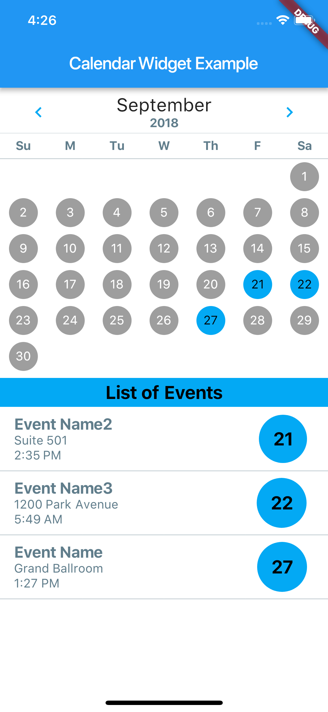

# calendar_view_widget



## About
A [Flutter](https://flutter.io) widget built to display a monthly calendar with a list of daily events shown below. The widget is intended to be used to fill a full scaffold body.


## Status: Under Development
**This package is under development and likely to change. The hope is not to break things, but new features may require updates to your code. Notes will be added below as breaking changes come along.**

### v0.0.3+ Breaking Change 
Prior to 0.0.3, the package used a list of events passed in the constructor as the calendar data for display. The widget has moved to a stream based list of events. This will allow for dynamic updates of events that is hopefully flexible enough to fit with your use case. The example shows a simple stream in use.

## Usage Details

### CalendarView

```
new CalendarView(
  eventStream: eventList, // Stream<List<Map<String, String>>>
  onEventTapped: onEventTappedHandler, // function(eventID)
  titleField: 'name', // String
  detailField: 'location', // String
  dateField: 'date', // String
  idField: 'id', // String
  separatorTitle: 'Events', // String
  theme: ThemeData.light(), // ThemeData
),
```

The calendar expects a stream of Events, as described below, in addition to some other configuration values. A list of events added to the stream will replace the existing list of events in the calendar.

The example above includes the default values for the String parameters (`titleField`, `detailField`, `dateField`, `idField`, and `separatorTitle`) as well as the default theme, `ThemeData.light()`. All of these may be overridden to suit your data structure and styling needs.

The `onEventTapped` handler should be a function that recieves an id value for an event. It can then be used to look up that event in your data and respond as needed in the rest of the app.

Example:

```
void onEventTapped(String id) {
  print(id);
}
```

### Events

Structure:
```
{
  'name': 'Event Name',
  'location': 'Event Location',
  'date': '2018-01-23 04:56:00',
  'id': '1',
}
```

Events are simply Maps with String keys and String values (`Map<String, String>`).

### Parameter Notes
The expectation is that there are at least 3 fields to use for the display: `titleField`, `detailField`, and `dateField`.

**Date Field Note**:
Inside the package, the date field is read using `DateTime.parse()`, so the date field string should use one of the range of formats it can ready.

An additional field can be used to as the `idField`, which should reference unique identifier field that is returned when a user taps on an event in the event list. The default is `'id'` but if one of the other three primary fields is unique, feel free to use that instead.

### Theming

The calendar allows for a ThemeData object to be passed to it to enable theming to match the rest of your app.

Fields used in ThemeData:
```
primaryColor,
accentColor,
canvasColor,
backgroundColor,
dividerColor,
textTheme: {
  display1,
  subhead,
  headline,
  title
},
accentTextTheme: {
  body1,
  title,
  display1
}
```

## Dependencies
* [intl](https://pub.dartlang.org/packages/intl) - provides the date formatting for display in the events list.

## Special Thanks
This package could not have been built without the awesomeness of [Dart](https://www.dartlang.org) and [Flutter](https://flutter.io). Thank you to the teams of people who have built the tools and infrastructure that enables this new app development ecosystem to grow and thrive.
